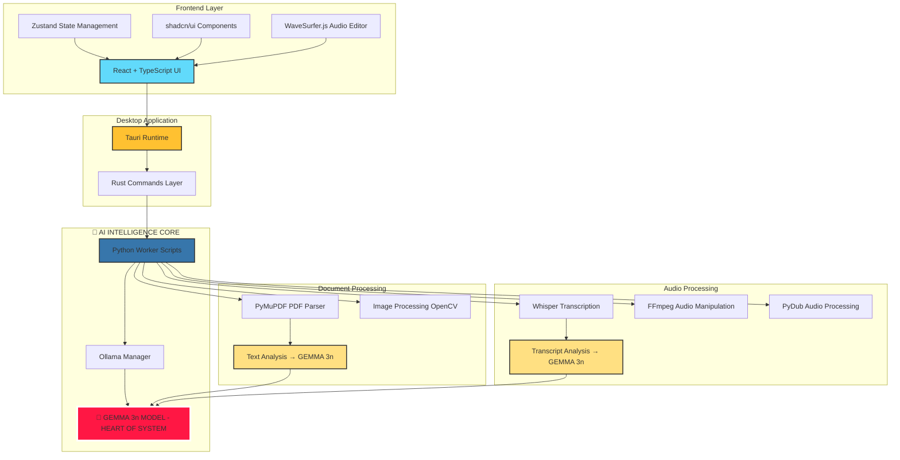

# 🛡️ Guardian R- 🧠 **Gemma 3n-Powered PII Detection** - Every word analyzed by Google's advanced language model for context-aware identificationdact

[](https://opensource.org/licenses/MIT)
[](https://tauri.app/)
[](https://reactjs.org/)
[](https://www.python.org/)

**Your Private, Offline Redaction Suite**

Guardian Redact is a privacy-first, on-device application that intelligently redacts sensitive information from documents and audio files. **Powered by Google's Gemma 3n model as its intelligent core**, Guardian Redact operates completely offline, ensuring your data never leaves your device. Every piece of content flows through Gemma 3n's advanced language understanding to identify and classify sensitive information with unprecedented accuracy.

---

## � Features

### 📄 **Document Redaction**
- �🎯 **AI-Powered PII Detection** - Automatically identifies names, addresses, phone numbers, emails, and more
- � **Intelligent Classification** - Gemma 3n understands context to distinguish between sensitive and non-sensitive information
- �🌍 **Multi-Language Support** - Gemma 3n's multilingual capabilities handle documents in Japanese, English, and more
- 📊 **Real-Time Progress** - Watch as each page flows through Gemma 3n analysis
- ✅ **Review & Accept** - Granular control over each Gemma 3n suggestion
- 🖱️ **Manual Selection** - Draw custom redaction areas for additional privacy
- 📥 **PDF Export** - Export permanently redacted PDFs with flattened black boxes

### 🎵 **Audio Redaction** 
- 🎤 **Speech Transcription** - Powered by Whisper for accurate word-level timestamps
- 🧠 **Gemma 3n Voice PII Analysis** - Every transcript word analyzed by Gemma 3n for intelligent PII detection
- 🔍 **Context-Aware Detection** - Gemma 3n understands speech patterns and conversational context
- 🎛️ **Multiple Redaction Types:**
  - 🔇 **Silence** - Complete audio removal
  - 📢 **Beep** - Replace with audible tone
  - 🎭 **Anonymize** - Pitch-shifted voice disguise
- 🌊 **Interactive Waveform** - Visual audio editor with region selection
- 💾 **MP3 Export** - Export redacted audio files

### 🔒 **Privacy & Security**
- 🏠 **100% Offline Processing** - No data ever leaves your device
- 🧠 **Local AI Models** - Embedded Gemma 3n for intelligent analysis
- 🚫 **No Cloud Dependencies** - Complete privacy guarantee
- 📱 **Cross-Platform** - Windows, macOS, and Linux support

---

## 🏗️ System Architecture

**The Gemma 3n Intelligence Core** - Every document and audio file flows through Google's Gemma 3n model as the central intelligence hub for PII detection and classification.



**Key Architecture Principle:** All sensitive data analysis flows through Gemma 3n as the single source of truth for PII detection, ensuring consistent and intelligent classification across all file types.

## 🚀 Technology Stack

### Frontend
- **Framework:** React 18 + TypeScript
- **UI Library:** shadcn/ui + Tailwind CSS
- **State Management:** Zustand
- **Audio Visualization:** WaveSurfer.js
- **PDF Rendering:** react-pdf + PDF.js
- **File Handling:** react-dropzone

### Desktop Application
- **Framework:** Tauri v1 (Rust + WebView)
- **System Integration:** Native file dialogs, window management
- **Cross-Platform:** Windows, macOS, Linux

### 🧠 AI Intelligence Core (Heart of System)
- **🎯 Primary Model:** Google Gemma 3n - The central intelligence processing ALL content analysis
- **🌟 Model Role:** Every PII detection decision flows through Gemma 3n's advanced language understanding
- **🚀 Runtime:** Ollama for local, private Gemma 3n inference
- **📊 Processing:** Context-aware classification with multilingual support

### Supporting Processing
- **Speech Recognition:** OpenAI Whisper (whisper-timestamped) → feeds to Gemma 3n
- **Document Processing:** PyMuPDF, PyPDF2 → feeds to Gemma 3n
- **Audio Processing:** PyDub, FFmpeg
- **Image Analysis:** OpenCV, Pillow → feeds to Gemma 3n

---

## 📦 Installation

### 🚀 Easy Setup (Recommended)

**For quick and easy deployment, download the pre-configured package:**

1. **Download Complete Package**
   ```
   📁 Download from: http://onedrive.com/?abc
   📂 Extract to: C:/coding/gemma/
   ```

2. **Run the Application** 
   ```bash
   # Windows - Double click or run:
   ./start-guardian-redact.bat
   
   # Linux/macOS - Run:
   ./start-guardian-redact.sh
   ```

**✅ That's it! Gemma 3n and all dependencies are pre-configured and ready to use.**

### 🛠️ Developer Setup (From Source)

### Prerequisites
- **Node.js** 18+ 
- **Python** 3.8+
- **Rust** (for building from source)
- **FFmpeg** (bundled with the application)

### Quick Start

1. **Clone the repository**
   ```bash
   git clone https://github.com/kaitorecca/guardian-redact.git
   cd guardian-redact
   ```

2. **Install dependencies**
   ```bash
   # Frontend dependencies
   npm install
   
   # Python dependencies
   pip install -r python-worker/requirements.txt
   ```

3. **Set up Gemma 3n AI model (Critical Step)**
   ```bash
   # Install Ollama
   # Windows: Download from https://ollama.ai
   # macOS: brew install ollama
   # Linux: curl -fsSL https://ollama.ai/install.sh | sh
   
   # Pull Gemma 3n model - This is the heart of the system!
   ollama pull gemma2:2b
   ```

4. **Run development server**
   ```bash
   npm run tauri:dev
   ```

### Building for Production

```bash
# Build optimized desktop application
npm run tauri:build
```

The built application will be available in `src-tauri/target/release/bundle/`

---

## 🎯 Usage

### Document Redaction Workflow

1. **📂 Select Mode** - Choose "Redact a Document" from the home screen
2. **📄 Upload PDF** - Drag & drop or select your PDF file
3. **⚙️ Choose Analysis** - Select "Fast Scan" or "Deep Analysis"
4. **🔍 Review Suggestions** - Watch real-time page-by-page processing
5. **✅ Accept/Reject** - Review and approve redaction suggestions
6. **🎨 Manual Redaction** - Add custom redactions by drawing areas
7. **💾 Export** - Download your redacted PDF

### Audio Redaction Workflow

1. **🎵 Select Mode** - Choose "Redact an Audio File" from the home screen
2. **📁 Upload Audio** - Select MP3, WAV, or other audio formats
3. **🎤 Transcription** - Automatic speech-to-text conversion
4. **🔍 PII Detection** - AI identifies sensitive spoken content
5. **✅ Review & Accept** - Approve detected PII items
6. **🌊 Waveform Editing** - Visual selection and redaction type choice
7. **🎧 Export** - Download your redacted audio file

---

## 🛠️ Development

### Project Structure

```
guardian-redact/
├── src/                     # React frontend
│   ├── components/          # UI components
│   ├── store/              # Zustand state management
│   └── utils/              # Utility functions
├── src-tauri/              # Tauri Rust backend
│   └── src/                # Rust commands and logic
├── python-worker/          # Python AI processing scripts
│   ├── process_page.py     # Document analysis
│   ├── process_audio.py    # Audio transcription & PII detection
│   ├── ollama_manager.py   # AI model communication
│   └── requirements.txt    # Python dependencies
├── ffmpeg/                 # Bundled FFmpeg binaries
└── docs/                   # Documentation
```

### Key Components

#### Frontend Architecture
- **HomeScreen.tsx** - Mode selection interface
- **DocumentViewer.tsx** - PDF rendering and redaction overlay
- **AudioEditor.tsx** - Waveform visualization and editing
- **AudioPIISidebar.tsx** - PII suggestion management

#### Backend Services
- **commands.rs** - Tauri command handlers
- **ollama_manager.py** - AI model communication
- **process_page.py** - Document analysis pipeline
- **process_audio.py** - Audio processing pipeline

### Development Commands

```bash
# Start development server
npm run tauri:dev

# Run Python tests
python -m pytest python-worker/tests/

# Build for production
npm run tauri:build

# Lint code
npm run lint
```

---

## 🤝 Contributing

We welcome contributions! Here's how to get started:

1. **Fork the repository**
2. **Create a feature branch** (`git checkout -b feature/amazing-feature`)
3. **Commit your changes** (`git commit -m 'Add amazing feature'`)
4. **Push to the branch** (`git push origin feature/amazing-feature`)
5. **Open a Pull Request**

### Development Guidelines
- Follow TypeScript best practices for frontend code
- Use Python type hints in backend scripts  
- Add tests for new features
- Update documentation as needed

---

## 📋 System Requirements

### Minimum Requirements
- **OS:** Windows 10, macOS 10.15, or Linux
- **RAM:** 4GB (8GB recommended for large documents)
- **Storage:** 2GB free space
- **CPU:** Dual-core processor (quad-core recommended)

### Recommended Requirements
- **RAM:** 16GB for optimal AI processing performance
- **CPU:** 8+ cores for faster document analysis
- **GPU:** Optional - CUDA support for accelerated processing

---

## 🐛 Troubleshooting

### Common Issues

**❓ Audio processing fails with FFmpeg error**
- Ensure FFmpeg is properly installed or use the bundled version
- Check audio file format compatibility

**❓ AI model not responding**
- Verify Ollama is running: `ollama list`
- Restart the application to reinitialize the AI connection

**❓ PDF rendering issues**
- Large PDFs may require additional memory
- Try processing smaller page ranges for memory-constrained systems

**❓ Japanese/Unicode text not displaying**
- Ensure your system has appropriate font support
- Unicode characters are automatically handled in the latest version

---

## 📄 License

This project is licensed under the MIT License - see the [LICENSE](LICENSE) file for details.

---

## 🙏 Acknowledgments

- **Google Gemma Team** - For the powerful language model
- **Tauri Community** - For the excellent desktop framework
- **OpenAI Whisper** - For accurate speech recognition
- **Ollama Project** - For local AI model management
- **React Community** - For the robust frontend ecosystem

---

## 📊 Project Status

**Current Version:** v0.1.0 (MVP)  
**Development Status:** Active Development  
**Last Updated:** August 2025

### Roadmap
- 🔄 **v0.2.0** - Enhanced multi-language support
- 🔄 **v0.3.0** - Batch processing capabilities  
- 🔄 **v0.4.0** - Advanced image redaction features
- 🔄 **v1.0.0** - Production-ready release

---

<div align="center">
  
**Built with ❤️ for Privacy & Security**

[📚 Documentation](docs/) • [🐛 Report Bug](issues/) • [💡 Request Feature](issues/)

</div>

- **100% Offline Processing**: Your documents never leave your device
- **Intelligent Redaction**: Context-aware detection of sensitive information
- **Multimodal Analysis**: Text, image, and simulated audio redaction
- **Real-time Progress**: Page-by-page processing with live updates
- **Professional UX**: Clean, modern interface built with shadcn/ui

## 🛠️ Tech Stack

- **Frontend**: React 18 + TypeScript + Vite
- **UI Framework**: Tauri (Rust-based desktop app)
- **UI Components**: shadcn/ui + Tailwind CSS
- **State Management**: Zustand
- **AI Backend**: Gemma 3n via Ollama
- **PDF Processing**: PyMuPDF + PyPDF2
- **Document Processing**: Python worker scripts

## 🚀 Quick Start

### Prerequisites

1. **Node.js** (v18 or higher)
2. **Rust** (for Tauri)
3. **Python** (3.8 or higher)
4. **Ollama** (for running Gemma models)

### Installation

1. **Clone and setup the project:**
   ```bash
   cd guardian-redact
   npm install
   ```

2. **Install Python dependencies:**
   ```bash
   pip install -r python-worker/requirements.txt
   ```

3. **Install and run Ollama with Gemma 3n:**
   ```bash
   # Install Ollama from https://ollama.ai
   ollama pull gemma3n
   ```

4. **Install Tauri CLI:**
   ```bash
   npm install -g @tauri-apps/cli
   ```

### Development

```bash
# Start the development server
npm run tauri:dev
```

### Building

```bash
# Build for production
npm run tauri:build
```

## 📋 Features Implemented (MVP)

✅ **Core Features**
- File selection and PDF upload
- Two-speed processing (Quick/Deep analysis) 
- Page-by-page processing with progress tracking
- Mock redaction suggestions generation
- Accept/reject redaction workflow
- Export functionality (placeholder)

✅ **UI/UX**
- Modern, clean interface
- Real-time progress indicators
- Sidebar with suggestions
- Status bar with processing info
- Responsive layout

✅ **Backend Architecture** 
- Tauri-based Rust backend
- Python worker scripts for AI processing
- Gemma 3n integration via Ollama
- PDF processing pipeline

## 🔮 Post-Hackathon Roadmap

- **Enhanced PDF Integration**: Real react-pdf integration
- **Advanced Face Detection**: Computer vision for image redaction  
- **Fine-tuned Models**: Unsloth-optimized Gemma models
- **Batch Processing**: Multiple document support
- **Video Redaction**: Face blurring and audio anonymization
- **App Store Distribution**: Mac App Store and Microsoft Store

## 🏆 Hackathon Submission

This project was created for the **Gemma 3n Impact Challenge** with a focus on:

- **Impact & Vision**: Solving real privacy concerns for journalists, lawyers, and researchers
- **Technical Depth**: Innovative use of offline-first AI with Gemma 3n
- **User Experience**: Superior UX for slow AI tasks with real-time feedback

## 🔒 Privacy & Security

- **Offline First**: All processing happens locally on your device
- **No Data Transmission**: Documents never uploaded to external servers  
- **Open Source**: Full transparency in processing methods
- **Local AI Models**: Gemma 3n runs entirely on your hardware

## 🧪 Demo Instructions

1. Launch the application
2. Select between "Quick Scan" or "Deep Analysis" 
3. Upload a PDF document
4. Watch real-time page-by-page processing
5. Review and accept/reject redaction suggestions
6. Export the redacted document

## 📝 License

MIT License - see LICENSE file for details

---

**Guardian Redact** - Protecting Privacy Through Intelligent Offline Redaction
