# 🏗️ Guardian Redact - System Architecture

## High-Level Architecture Overview

**Central Intelligence Design:** Guardian Redact is architected around Google's Gemma 3n model as the primary intelligence core. Every piece of content—whether document text, images, or audio transcripts—flows through Gemma 3n for context-aware PII detection and classification.

**Architecture Principle:** Gemma 3n serves as the singular intelligence hub—no PII detection occurs without its analysis. This ensures consistent, context-aware classification across all media types.

## Data Flow Architecture

## Component Architecture

## AI Processing Pipeline

**Gemma 3n Central Processing Flow:** Every piece of content analysis flows through Google's Gemma 3n model as the single source of intelligence.

```mermaid
flowchart TD
    A[Input File] --> B{File Type?}
    
    B -->|PDF| C[PyMuPDF Parser]
    B -->|Audio| D[Whisper Transcription]
    
    C --> E[Extract Text & Images]
    C --> F[Page-by-Page Processing]
    
    D --> G[Word-Level Timestamps]
    D --> H[Formatted Transcript]
    
    E --> I[🧠 GEMMA 3n ANALYSIS - SYSTEM HEART]
    F --> I
    G --> J[🧠 GEMMA 3n ANALYSIS - SYSTEM HEART]
    H --> J
    
    I --> K[Document PII Classification]
    J --> L[Audio PII Classification]
    
    K --> M[Bounding Box Coordinates]
    L --> N[Time-based Segments]
    
    M --> O[Frontend Rendering]
    N --> P[Waveform Visualization]
    
    O --> Q[User Review & Accept]
    P --> R[User Review & Accept]
    
    Q --> S[PDF Export with Redactions]
    R --> T[Audio Export with Redactions]
    
    style I fill:#FF1744,stroke:#fff,stroke-width:3px
    style J fill:#FF1744,stroke:#fff,stroke-width:3px
    style A fill:#e8f5e8
    style S fill:#e8f5e8
    style T fill:#e8f5e8
```

**Critical Design:** No PII detection occurs without Gemma 3n analysis. All text, images (via OCR), and transcripts are processed through the same intelligent core for consistent, context-aware results.

## Security & Privacy Architecture

```mermaid
graph TB
    subgraph "Local Device Boundary"
        subgraph "Application Sandbox"
            A[User Files]
            B[Temporary Processing]
            C[AI Models]
            D[Processed Output]
        end
        
        subgraph "System Resources"
            E[Local File System]
            F[Memory Management] 
            G[CPU/GPU Processing]
        end
    end
    
    subgraph "External Boundaries"
        H[❌ No Internet Required]
        I[❌ No Cloud Services]
        J[❌ No Data Transmission]
    end
    
    A --> B
    B --> C
    C --> D
    D --> E
    
    B --> F
    C --> G
    
    style A fill:#c8e6c9
    style B fill:#fff9c4
    style C fill:#ffcdd2
    style D fill:#c8e6c9
    style H fill:#ffcdd2
    style I fill:#ffcdd2
    style J fill:#ffcdd2
```

## Technology Stack Detail

```mermaid
mindmap
  root((Guardian Redact))
    🧠 INTELLIGENCE CORE
      🎯 GEMMA 3n MODEL
        Context Understanding
        Multilingual Analysis
        PII Classification
        Privacy Intelligence
      Ollama Runtime
        Local Processing
        No Cloud Required
        Complete Privacy
      🎤 Speech Processing
        Whisper ASR
        whisper-timestamped
        → Feeds to Gemma 3n
    
    Frontend
      React 18
        TypeScript
        Zustand State
        shadcn/ui
      Visualization
        react-pdf
        WaveSurfer.js
        Canvas API
      Styling
        Tailwind CSS
        Radix UI
        Lucide Icons
    
    Desktop
      Tauri v1
        Rust Backend
        WebView Frontend
        Native APIs
      Platform
        Windows
        macOS  
        Linux
    
    Media Processing
      Documents
        PyMuPDF → Gemma 3n
        PyPDF2 → Gemma 3n
        OpenCV → Gemma 3n
      Audio
        FFmpeg
        PyDub
        Audio Manipulation
      Export
        PDF Flattening
        MP3 Generation
```

---

## Performance Characteristics

| Component | Processing Time | Memory Usage | Notes |
|-----------|----------------|--------------|-------|
| PDF Analysis | 2-5s per page | 100-500MB | Depends on page complexity |
| Audio Transcription | 1:4 ratio | 200-1GB | Real-time processing |
| PII Detection | 1-3s per analysis | 50-200MB | Model inference time |
| Export Generation | 5-30s | 100-2GB | File size dependent |

## Scalability Considerations

- **Document Size**: Optimized for documents up to 100 pages
- **Audio Length**: Supports files up to 2 hours efficiently  
- **Memory Management**: Streaming processing for large files
- **Parallel Processing**: Multi-core CPU utilization
- **Model Caching**: AI models loaded once, reused for speed

---

*This architecture ensures complete privacy by keeping all processing local while maintaining high performance and user experience quality.*
